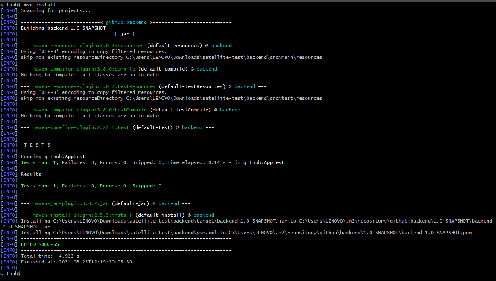
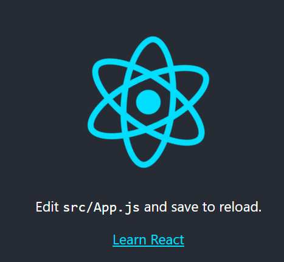

## Pre-Requisites to the workshop

> Note: The following steps are pre-requisite to know before the workshop. All the source code generated after performing these steps have already been incorporated in this repository. You may follow these steps if you wish to replicate the repository at your workstation. 

### Creating Hello, World! Java Application with Apache Maven

```
# Create the Hello, World! Application
mvn archetype:generate -DgroupId=github -DartifactId=backend \
-DarchetypeArtifactId=maven-archetype-quickstart \
-DarchetypeVersion=1.4 -DinteractiveMode=false

# Test the demo application
mvn clean 
mvn compile
mvn test
mvn install
```



### Creating Hello, World! React Application with Create-React-App

```
npx create-react-app frontend
cd frontend
npm install # if node_modules/ is not present
npm run start
```



### References

- [React Docs: Create-React-App](https://reactjs.org/docs/create-a-new-react-app.html)